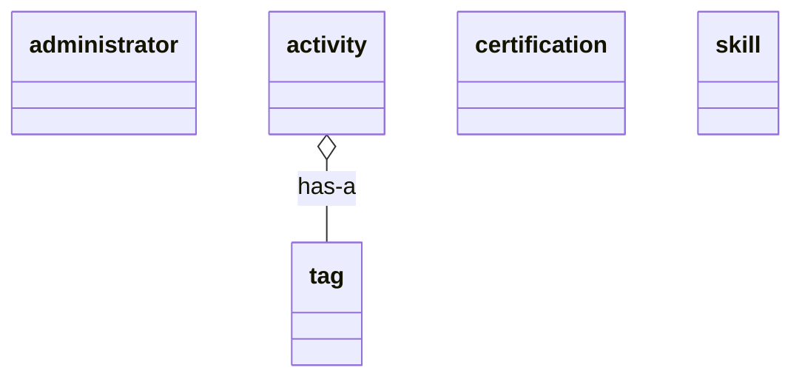

# ① ドメインモデル

作成ルール：[docs/01_ドメインモデルの書き方.md](../docs/01_ドメインモデルの書き方.md)

## 1. テキスト分析

`00_概要.md`のスコープ説明、および後述のユースケース記述案から名詞・名詞句を抜き出した。

```
【対象文章（例）】
訪問者はプロフィール画面で活動実績・資格・スキルを閲覧する。
管理者はログインし、活動実績を登録・編集・削除する。活動実績にはタグを複数付けられる。
管理者は資格情報・スキルについても同様に登録・編集・削除する。

【抜き出した名詞】
訪問者／プロフィール画面／活動実績／資格／スキル／管理者／ログイン／タグ

【候補クラスとして残すもの】
administrator（管理者）／activity（活動実績）／certification（資格）／skill（スキル）／tag（タグ）

※「プロフィール画面」はバウンダリ（画面）であり、ドメインモデルには含めない
※「ログイン」は動詞（ふるまい）であり、ユースケース・コントローラの候補であってドメインモデルのクラスにはしない
```

## 2. 候補クラス一覧

| クラス名 | 説明 | 実装対応 |
| --- | --- | --- |
| `administrator` | ログインしてプロフィール内容を編集する人。本システムでは1名のみ | Django標準の`User`モデルを利用（新規モデルは作らない） |
| `activity` | 活動・実績の1件（例：ハッカソン参加歴） | 新規モデル。実装クラス名は`Activity`（Pythonの慣例に合わせパスカルケース） |
| `certification` | 保有資格・検定の1件 | 新規モデル。実装クラス名は`Certification` |
| `skill` | 保有スキルの1件 | 新規モデル。実装クラス名は`Skill` |
| `tag` | 活動実績に付与する属性（例：Winner、organizer） | 新規モデル。実装クラス名は`Tag` |

> プロフィールヘッダー（氏名・学校情報・SNSリンク・アバター画像）は`00_概要.md`の方針により編集対象外（テンプレート固定値）のため、候補クラスに含めていない。

## 3. クラス間の関係

| 関係 | 種類 | 説明 |
| --- | --- | --- |
| `activity` has-a `tag` | has-a（集約）。ひし形は`activity`側 | 1件の活動実績は複数のタグを持ちうる。1つのタグは複数の活動実績で使われうる（多対多）。多重度は[05_クラス図.md](05_クラス図.md)で確定する |

`administrator`・`certification`・`skill`は、他クラスとの間にis-a／has-a関係を持たない（本システムは単一プロフィールを前提とし、所有者を表す関連づけは行わない）。

## 4. ドメインモデル図



## 5. チェックリスト

- [x] ユースケース記述（想定）に出てくる名詞が、ドメインモデルのどこかに反映されている
- [x] クラス名は名詞（体言）になっている（動詞になっていない）
- [x] クラス名が英単語の小文字・アンダースコア区切り（スネークケース）で統一されている
- [x] has-aはひし形＋実線で描き分けられている（is-aは本システムには存在しない）
- [x] 属性・メソッドを書き込んでいない
- [x] 画面やコントローラなど、実装寄りの要素が混ざっていない
