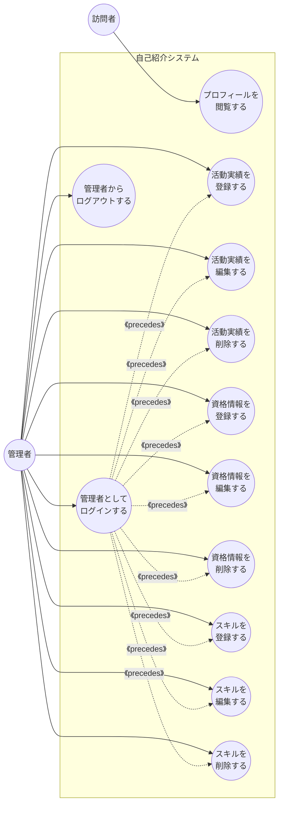

# ② ユースケース図・記述

作成ルール：[docs/02_ユースケース図_記述の書き方.md](../docs/02_ユースケース図_記述の書き方.md)

## 1. アクター

| アクター | 分類 | 説明 |
| --- | --- | --- |
| 訪問者 | 主アクター | プロフィール画面を閲覧する一般の来訪者 |
| 管理者 | 主アクター | ログインして活動実績・資格・スキルを編集する、プロフィール所有者本人 |

## 2. ユースケース一覧

| # | ユースケース名 | アクター |
| --- | --- | --- |
| 1 | プロフィールを閲覧する | 訪問者 |
| 2 | 管理者としてログインする | 管理者 |
| 3 | 管理者からログアウトする | 管理者 |
| 4 | 活動実績を登録する | 管理者 |
| 5 | 活動実績を編集する | 管理者 |
| 6 | 活動実績を削除する | 管理者 |
| 7 | 資格情報を登録する | 管理者 |
| 8 | 資格情報を編集する | 管理者 |
| 9 | 資格情報を削除する | 管理者 |
| 10 | スキルを登録する | 管理者 |
| 11 | スキルを編集する | 管理者 |
| 12 | スキルを削除する | 管理者 |

## 3. ユースケース図

「管理者としてログインする」の事後条件（管理者としてログイン済みの状態）が、4〜12番の各ユースケースの事前条件になっている。ログインはその場で呼び出される処理ではなく、以前のどこかのタイミングで完了していればよい関係のため《invokes》ではなく《precedes》とする。

## 4. ユースケース記述

### 4.1 プロフィールを閲覧する

- **主アクター**：訪問者
- **事前条件**：システムが稼働している状態である
- **事後条件**：プロフィール画面に活動実績・資格・スキルの最新情報が表示された状態になる
- **基本フロー**：
  1. 訪問者はプロフィールページへアクセスする。
  2. システムは活動実績の一覧を取得する。
  3. システムは資格の一覧を取得する。
  4. システムはスキルの一覧を取得する。
  5. システムはプロフィール画面に取得した情報を表示する。
- **代替フロー**：
  - ②a. 活動実績・資格・スキルのいずれかが1件も登録されていない場合、システムは該当セクションを空欄（未登録）として表示する。

### 4.2 管理者としてログインする

- **主アクター**：管理者
- **事前条件**：管理者アカウントが登録されている状態である
- **事後条件**：管理者としてシステムにログイン済みの状態になる
- **基本フロー**：
  1. 管理者はログイン画面を開く。
  2. 管理者はユーザー名とパスワードを入力する。
  3. システムは入力された認証情報を照合する。
  4. システムは管理者を認証済み状態にし、管理画面へ遷移させる。
- **代替フロー**：
  - ③a. 認証情報が一致しない場合、システムはエラーメッセージを表示し、ログイン画面に留まる。

### 4.3 管理者からログアウトする

- **主アクター**：管理者
- **事前条件**：管理者としてログイン済みである
- **事後条件**：管理者のログイン状態が解除され、プロフィール画面（訪問者と同じ表示）に戻る
- **基本フロー**：
  1. 管理者は管理画面のログアウトボタンを選択する。
  2. システムは管理者の認証状態を解除する。
  3. システムはプロフィール画面へ遷移させる。
- **代替フロー**：なし

### 4.4 活動実績を登録する

- **主アクター**：管理者
- **事前条件**：管理者としてログイン済みである
- **事後条件**：新しい活動実績が登録され、プロフィール画面に反映された状態になる
- **基本フロー**：
  1. 管理者は管理画面から活動実績登録画面を開く。
  2. 管理者はアイコン・内容・タグを入力する。
  3. システムは入力内容を検証する。
  4. システムは活動実績を登録する。
  5. システムは管理画面に登録結果を表示する。
- **代替フロー**：
  - ③a. 入力内容に不備がある場合、システムはエラーメッセージを表示し、活動実績登録画面に留まる。

### 4.5 活動実績を編集する

- **主アクター**：管理者
- **事前条件**：管理者としてログイン済みであり、編集対象の活動実績が存在する
- **事後条件**：指定した活動実績の内容が更新された状態になる
- **基本フロー**：
  1. 管理者は管理画面から編集したい活動実績を選択する。
  2. システムは活動実績編集画面に現在の内容を表示する。
  3. 管理者はアイコン・内容・タグを変更する。
  4. システムは入力内容を検証する。
  5. システムは活動実績を更新する。
  6. システムは管理画面に更新結果を表示する。
- **代替フロー**：
  - ④a. 入力内容に不備がある場合、システムはエラーメッセージを表示し、活動実績編集画面に留まる。

### 4.6 活動実績を削除する

- **主アクター**：管理者
- **事前条件**：管理者としてログイン済みであり、削除対象の活動実績が存在する
- **事後条件**：指定した活動実績が削除された状態になる
- **基本フロー**：
  1. 管理者は管理画面から削除したい活動実績を選択する。
  2. システムは活動実績削除確認画面に対象の内容を表示する。
  3. 管理者は削除を確定する。
  4. システムは活動実績を削除する。
  5. システムは管理画面に削除結果を表示する。
- **代替フロー**：
  - ③a. 管理者が削除をキャンセルした場合、システムは管理画面へ戻す。

### 4.7 資格情報を登録する

- **主アクター**：管理者
- **事前条件**：管理者としてログイン済みである
- **事後条件**：新しい資格情報が登録され、プロフィール画面に反映された状態になる
- **基本フロー**：
  1. 管理者は管理画面から資格登録画面を開く。
  2. 管理者はアイコン・内容を入力する。
  3. システムは入力内容を検証する。
  4. システムは資格情報を登録する。
  5. システムは管理画面に登録結果を表示する。
- **代替フロー**：
  - ③a. 入力内容に不備がある場合、システムはエラーメッセージを表示し、資格登録画面に留まる。

### 4.8 資格情報を編集する

- **主アクター**：管理者
- **事前条件**：管理者としてログイン済みであり、編集対象の資格情報が存在する
- **事後条件**：指定した資格情報の内容が更新された状態になる
- **基本フロー**：
  1. 管理者は管理画面から編集したい資格情報を選択する。
  2. システムは資格編集画面に現在の内容を表示する。
  3. 管理者はアイコン・内容を変更する。
  4. システムは入力内容を検証する。
  5. システムは資格情報を更新する。
  6. システムは管理画面に更新結果を表示する。
- **代替フロー**：
  - ④a. 入力内容に不備がある場合、システムはエラーメッセージを表示し、資格編集画面に留まる。

### 4.9 資格情報を削除する

- **主アクター**：管理者
- **事前条件**：管理者としてログイン済みであり、削除対象の資格情報が存在する
- **事後条件**：指定した資格情報が削除された状態になる
- **基本フロー**：
  1. 管理者は管理画面から削除したい資格情報を選択する。
  2. システムは資格削除確認画面に対象の内容を表示する。
  3. 管理者は削除を確定する。
  4. システムは資格情報を削除する。
  5. システムは管理画面に削除結果を表示する。
- **代替フロー**：
  - ③a. 管理者が削除をキャンセルした場合、システムは管理画面へ戻す。

### 4.10 スキルを登録する

- **主アクター**：管理者
- **事前条件**：管理者としてログイン済みである
- **事後条件**：新しいスキルが登録され、プロフィール画面に反映された状態になる
- **基本フロー**：
  1. 管理者は管理画面からスキル登録画面を開く。
  2. 管理者はスキル名を入力する。
  3. システムは入力内容を検証する。
  4. システムはスキルを登録する。
  5. システムは管理画面に登録結果を表示する。
- **代替フロー**：
  - ③a. 入力内容に不備がある場合（未入力・重複など）、システムはエラーメッセージを表示し、スキル登録画面に留まる。

### 4.11 スキルを編集する

- **主アクター**：管理者
- **事前条件**：管理者としてログイン済みであり、編集対象のスキルが存在する
- **事後条件**：指定したスキルの内容が更新された状態になる
- **基本フロー**：
  1. 管理者は管理画面から編集したいスキルを選択する。
  2. システムはスキル編集画面に現在の内容を表示する。
  3. 管理者はスキル名を変更する。
  4. システムは入力内容を検証する。
  5. システムはスキルを更新する。
  6. システムは管理画面に更新結果を表示する。
- **代替フロー**：
  - ④a. 入力内容に不備がある場合（未入力・重複など）、システムはエラーメッセージを表示し、スキル編集画面に留まる。

### 4.12 スキルを削除する

- **主アクター**：管理者
- **事前条件**：管理者としてログイン済みであり、削除対象のスキルが存在する
- **事後条件**：指定したスキルが削除された状態になる
- **基本フロー**：
  1. 管理者は管理画面から削除したいスキルを選択する。
  2. システムはスキル削除確認画面に対象の内容を表示する。
  3. 管理者は削除を確定する。
  4. システムはスキルを削除する。
  5. システムは管理画面に削除結果を表示する。
- **代替フロー**：
  - ③a. 管理者が削除をキャンセルした場合、システムは管理画面へ戻す。

## 5. チェックリスト

- [x] ユースケース名がすべて「●●を△△する」の形式で統一されている
- [x] 事前条件・事後条件が明記され、事後条件が事前条件のすぐ下に配置されている
- [x] 基本フローが①②③…の丸数字で書かれている
- [x] 代替フローが「③a.」のように分岐元の番号＋枝番で書かれている
- [x] 基本フローの各文が「1文＝1アクション」になっている
- [x] ユースケース図の関係が《precedes》で表されている（《include》《extend》は使っていない）
- [x] UIの詳細や実装技術に踏み込みすぎていない
