# ③ ロバストネス図

作成ルール：[docs/03_ロバストネス図の書き方.md](../docs/03_ロバストネス図の書き方.md)

凡例：`(( ))`＝アクター、`[[ ]]`＝バウンダリ（画面）、`{{ }}`＝コントローラ、`[( )]`＝エンティティ。実線＝基本フロー、破線＝代替フロー。エンティティ名は日本語（実装名は書かない。実装対応は[01_ドメインモデル.md](01_ドメインモデル.md)を参照）。

## 1. プロフィールを閲覧する

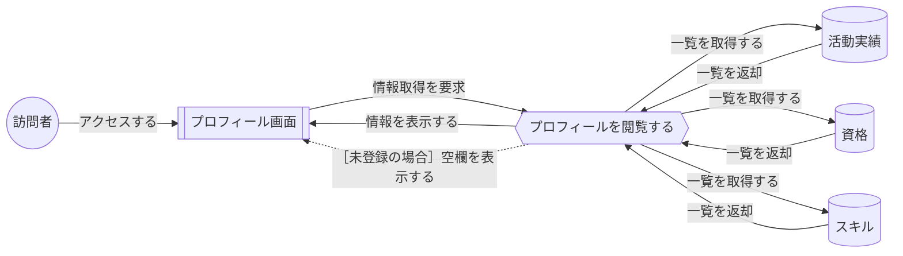

## 2. 管理者としてログインする

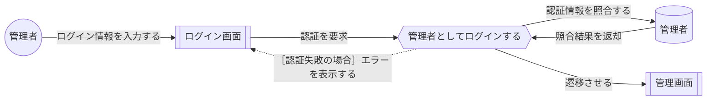

## 3. 管理者からログアウトする

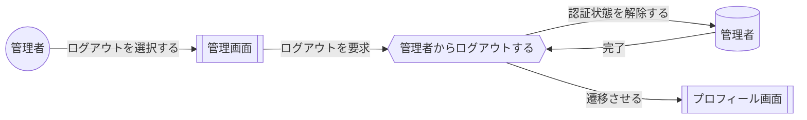

## 4. 活動実績を登録する

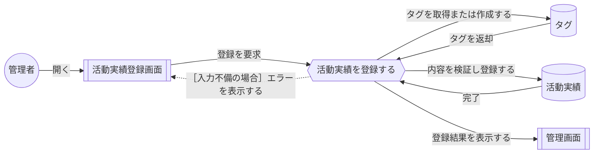

## 5. 活動実績を編集する

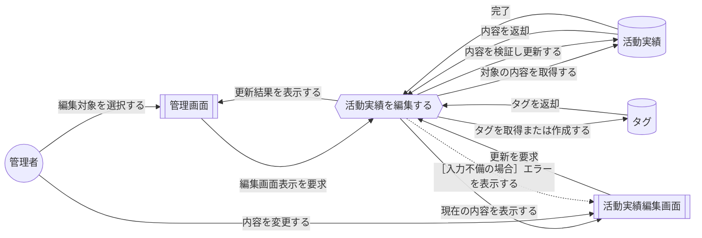

## 6. 活動実績を削除する

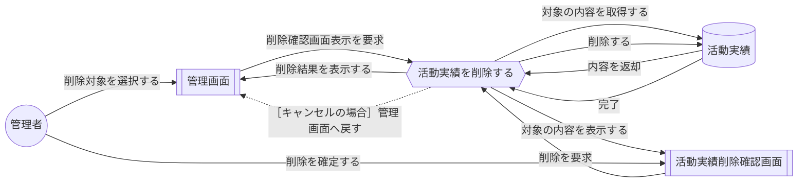

## 7. 資格情報を登録する

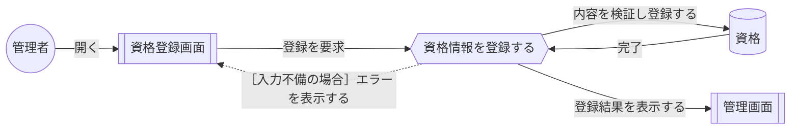

## 8. 資格情報を編集する

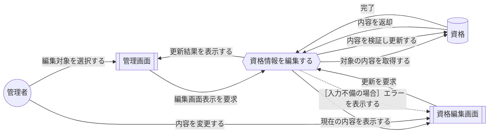

## 9. 資格情報を削除する

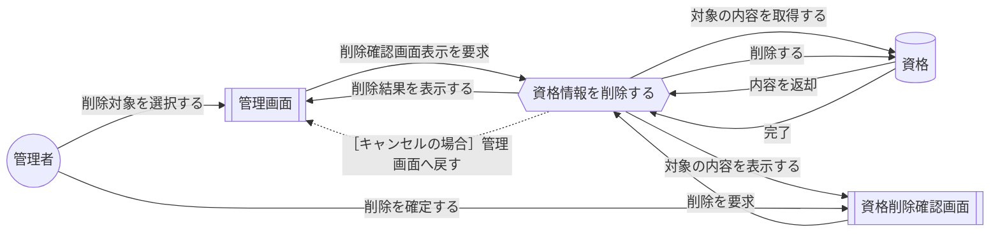

## 10. スキルを登録する

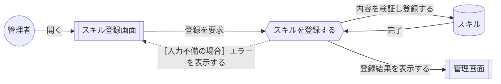

## 11. スキルを編集する

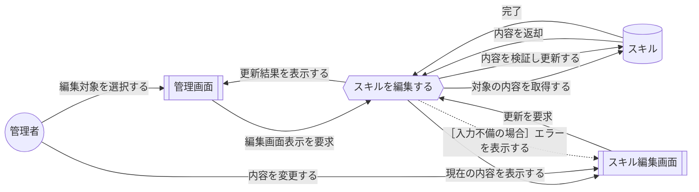

## 12. スキルを削除する

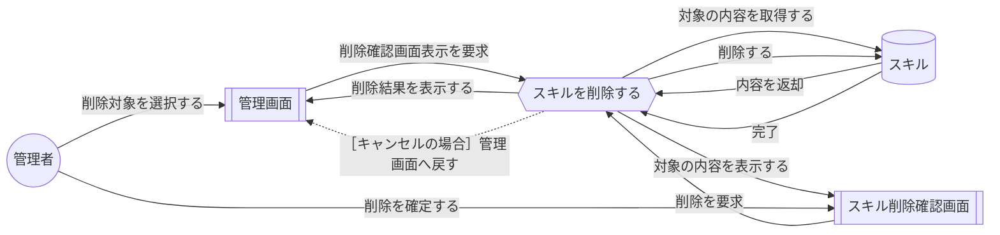

## チェックリスト

- [x] バウンダリ・コントローラ・エンティティの3種類が正しく区別されている
- [x] バウンダリとエンティティが直接つながっていない
- [x] アクターがバウンダリを介さずにコントローラ／エンティティへ直接つながっていない
- [x] ユースケース記述の基本フロー・代替フローの文が、すべて図の中に反映されている
- [x] 基本フローは実線、代替フローは破線で描き分けられている
- [x] 代替フローの矢印に［条件］のラベルが添えられている
- [x] バウンダリが「●●画面」、コントローラが「●●を●●する」、エンティティが「●●」の日本語表記で統一されている
- [x] 英単語（実装名）がロバストネス図に紛れ込んでいない
- [x] 1つのコントローラに処理が詰め込まれすぎていない
