# ④ シーケンス図

作成ルール：[docs/04_シーケンス図の書き方.md](../docs/04_シーケンス図の書き方.md)

本演習の範囲に合わせ、活性区間・loopフレームは記述しない。GET／POSTはアクター（ブラウザ）↔view間のみに用い、view→モデル間の内部呼び出しには使わない。リダイレクトは「呼び出し元へ戻す（302）→新しいリクエスト」の2段階で描く。

viewの参加者名は、[03_ロバストネス図.md](03_ロバストネス図.md)の各コントローラ（●●を●●する）に対応するDjangoのview関数を指す。モデル名は[05_クラス図.md](05_クラス図.md)で確定する実装クラス名（`Activity`／`Certification`／`Skill`／`Tag`、管理者はDjango標準の`User`）を用いる。

## 1. プロフィールを閲覧する

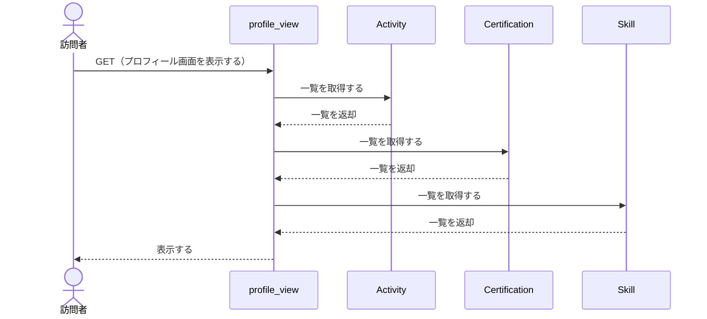

## 2. 管理者としてログインする

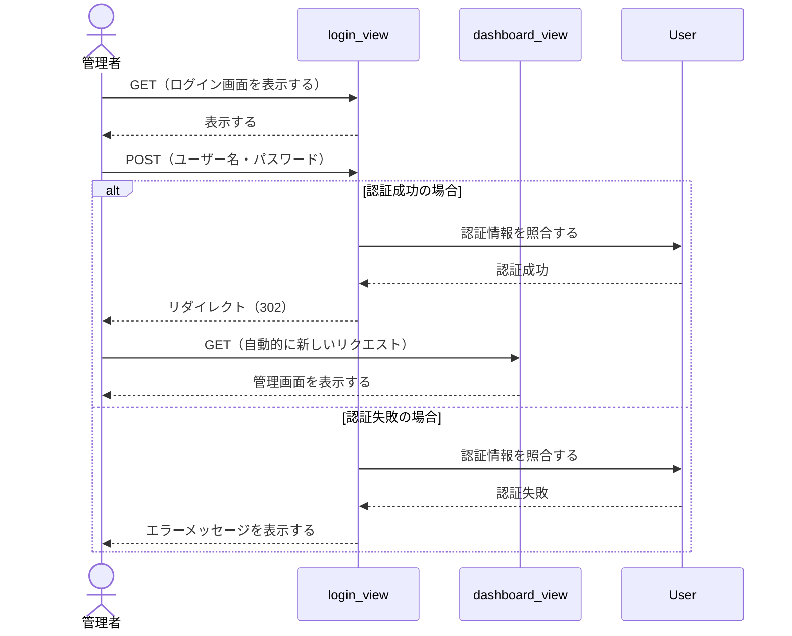

## 3. 管理者からログアウトする

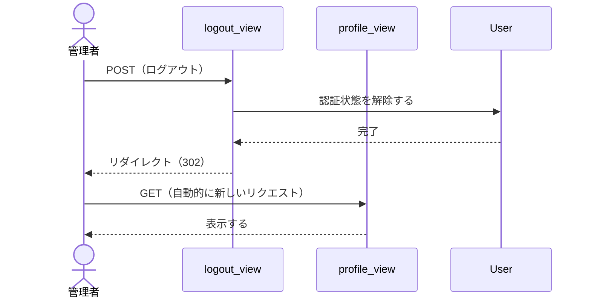

## 4. 活動実績を登録する

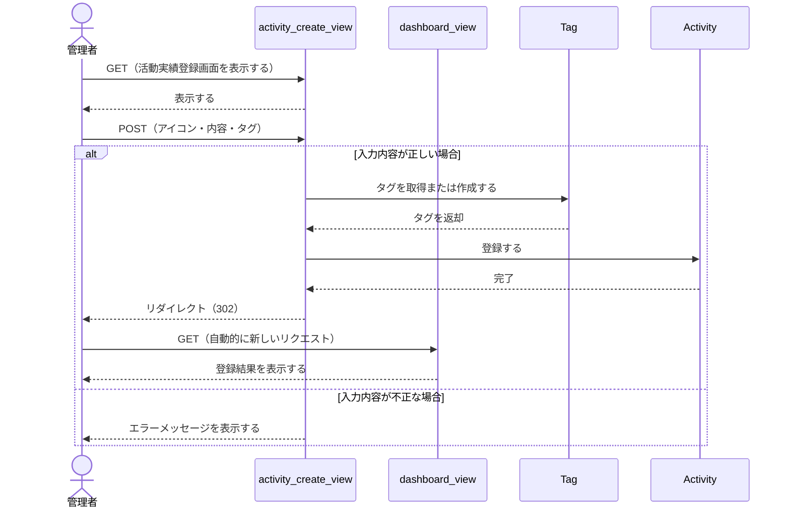

## 5. 活動実績を編集する

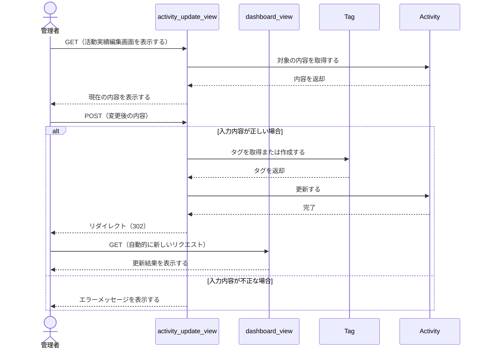

## 6. 活動実績を削除する

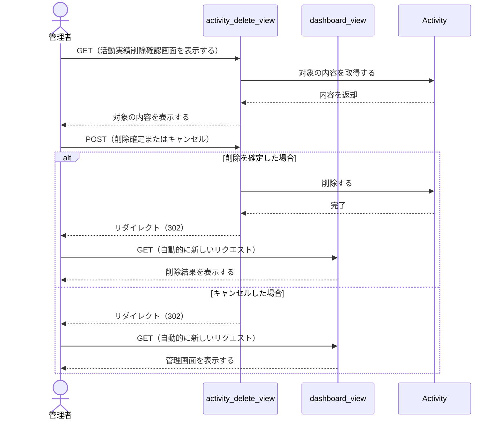

## 7. 資格情報を登録する

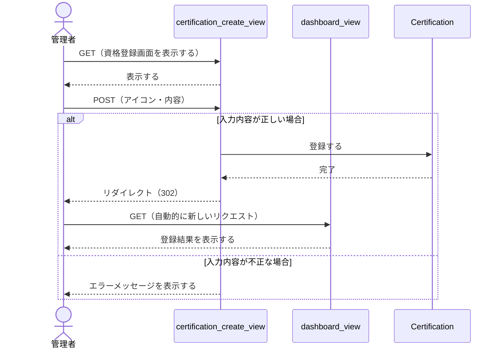

## 8. 資格情報を編集する

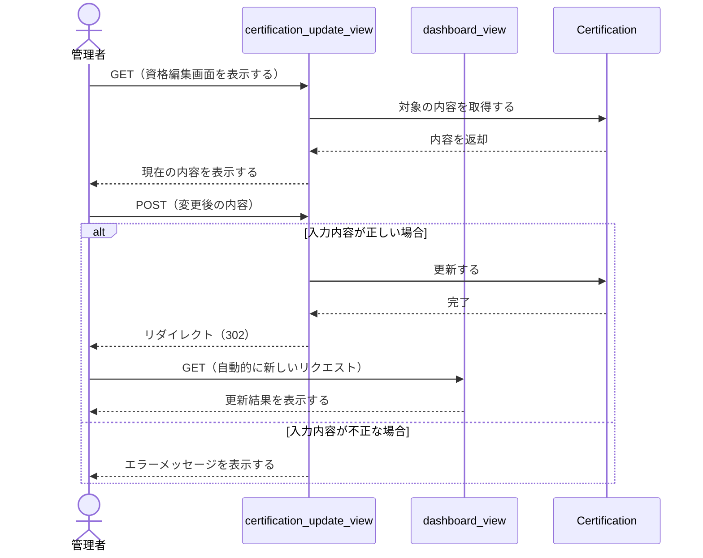

## 9. 資格情報を削除する

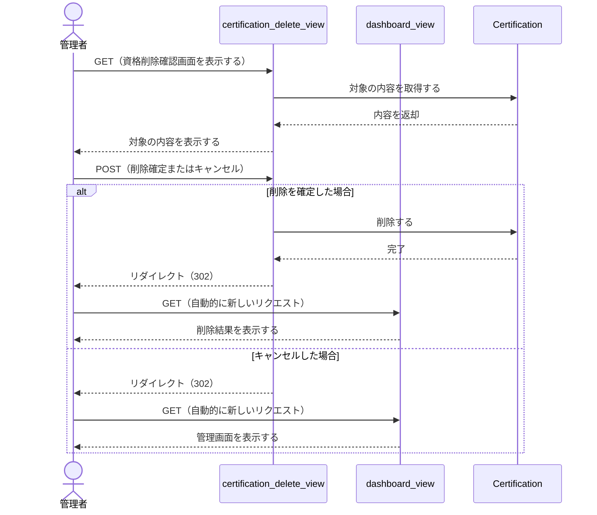

## 10. スキルを登録する

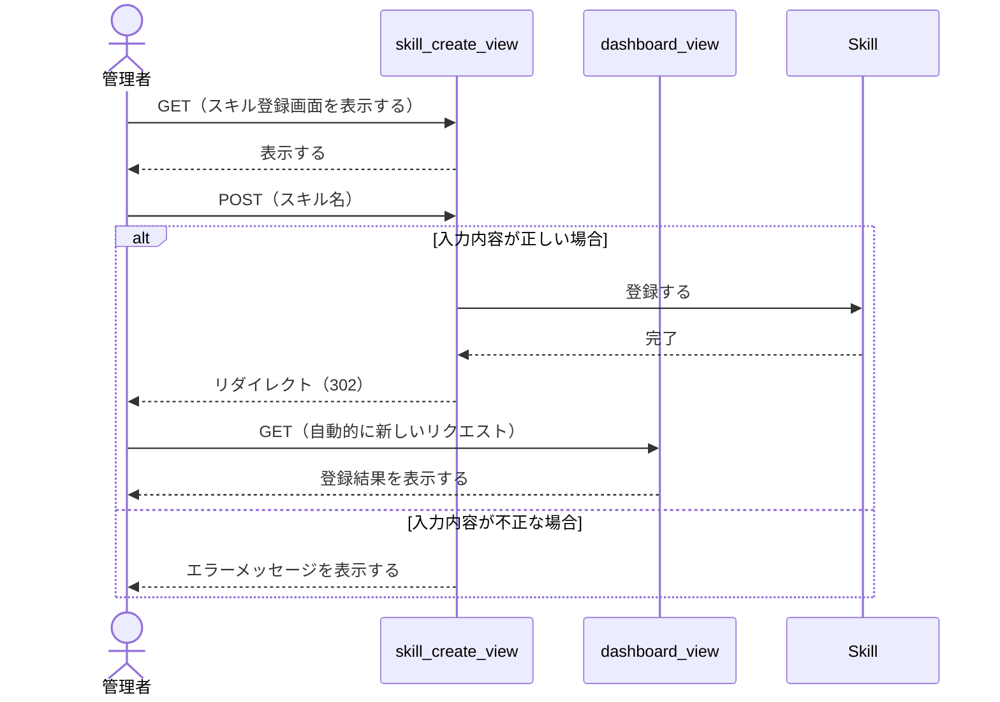

## 11. スキルを編集する

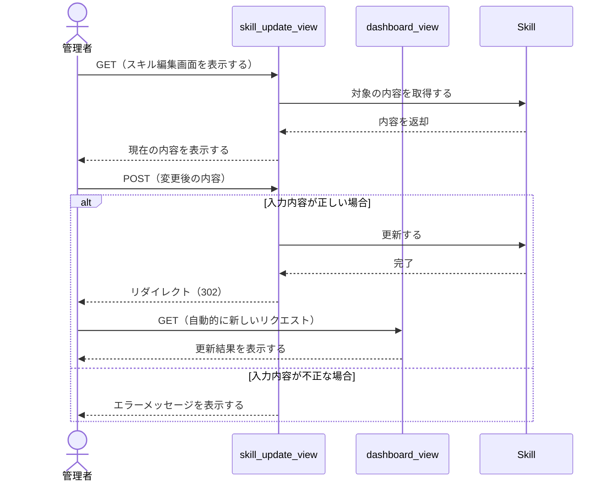

## 12. スキルを削除する

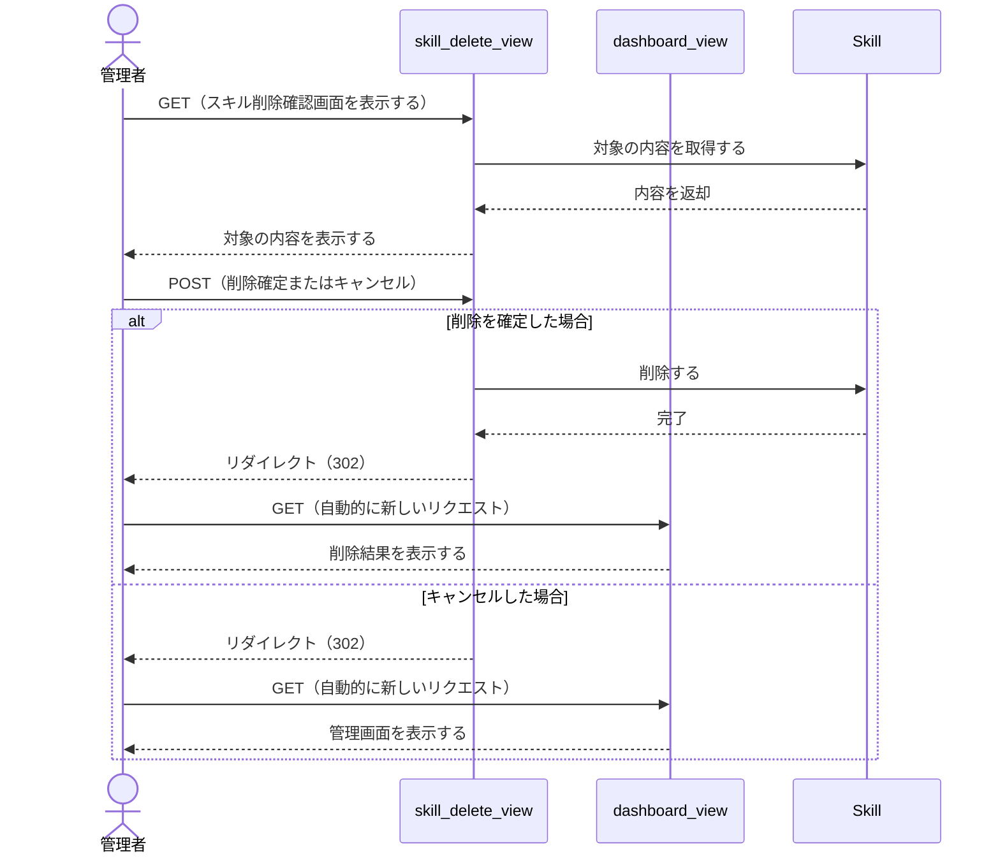

## チェックリスト

- [x] すべてのライフラインが、対応するロバストネス図の要素と一致している
- [x] メッセージ名が、処理内容の伝わる日本語のラベルになっている（関数名までは書いていない）
- [x] 呼び出しに対する戻り（return）が、呼び出し元まできちんと戻っている
- [x] GET／POSTは、アクター（ブラウザ）とview間の通信にのみ使われている
- [x] リダイレクトが、正しく「戻り」＋「新しいリクエスト」の2段階で描かれている
- [x] altフレームの中に、実際のメッセージ矢印が描かれている
