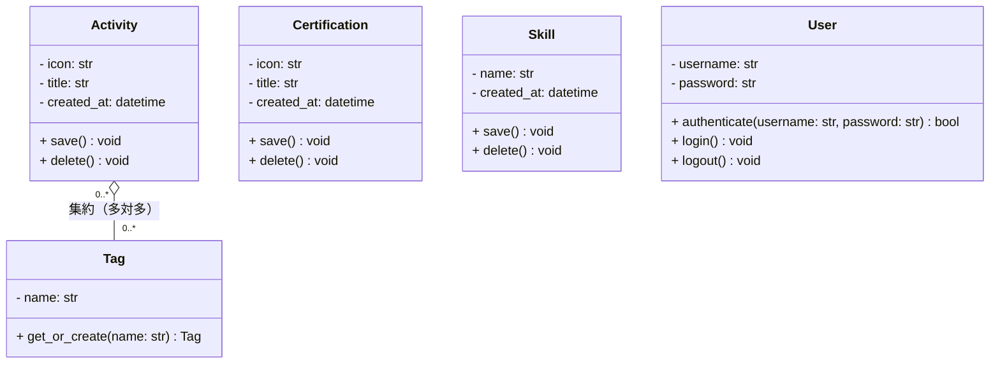
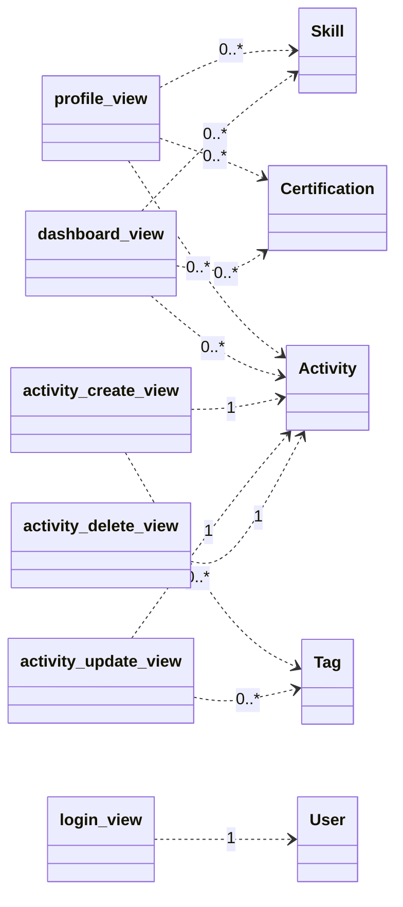

# ⑤ クラス図

作成ルール：[docs/05_クラス図の書き方.md](../docs/05_クラス図の書き方.md)

## 1. ドメインクラス（Model）

[01_ドメインモデル.md](01_ドメインモデル.md)の候補クラスに、[04_シーケンス図.md](04_シーケンス図.md)で確定したメソッドと属性を反映した。属性名・メソッド名は実装（Django）に合わせてPythonの命名規則（スネークケース）で記載する。`administrator`は新規モデルを作らずDjango標準の`User`を用いるため、`User`として記載する。

### 1.1 属性・メソッドの補足

| クラス | 補足 |
| --- | --- |
| `Activity` | `icon`はアイコン名の文字列（例：`trophy`）、`title`は実績の内容テキスト。`created_at`は登録日時で、プロフィール画面での表示順（登録順）の基準に使う |
| `Certification` | `Activity`と同じ構造だが、タグとの関連は持たない |
| `Skill` | アイコンを持たず、スキル名のみ（旧`profile.json`の`skills`が文字列配列だったことに対応） |
| `Tag` | `name`は一意制約を持つ。`get_or_create()`は、活動実績の登録・編集フォームで入力されたタグ名から、既存タグの取得または新規作成を行う |
| `User` | Django標準の認証機構をそのまま利用するため、`password`はハッシュ化された状態で保持される。`authenticate()`・`login()`・`logout()`はDjangoの認証フレームワークが提供する機能に対応する |

### 1.2 多重度

`Activity "0..*" o-- "0..*" Tag`：1件の活動実績は0個以上のタグを持ち、1つのタグは0件以上の活動実績に使われる。

`Certification`・`Skill`・`User`は、他クラスとの関連を持たない（本システムは単一プロフィールを前提とするため、所有者を表す外部キーは持たせない）。

## 2. View（コントローラ）とModelの依存関係

[03_ロバストネス図.md](03_ロバストネス図.md)のコントローラは、実装上はDjangoの関数ベースビュー（views.pyの関数）になる。ViewはModelを「何件」扱うかによって、一覧処理（`0..*`）か単一データ処理（`1`）かが分かれる。

| View（コントローラ） | 対応ユースケース | 依存するModel | 多重度 |
| --- | --- | --- | --- |
| `profile_view` | プロフィールを閲覧する | `Activity` / `Certification` / `Skill` | 0..*（一覧表示） |
| `login_view` | 管理者としてログインする | `User` | 1（ユーザー名が一致する1人を照合） |
| `logout_view` | 管理者からログアウトする | `User` | 1（ログイン中の1人を対象） |
| `dashboard_view` | （管理画面の表示。各CRUDユースケースの起点） | `Activity` / `Certification` / `Skill` | 0..*（一覧表示） |
| `activity_create_view` | 活動実績を登録する | `Activity` / `Tag` | `Activity`：1（新規登録）／`Tag`：0..*（複数タグを取得・作成） |
| `activity_update_view` | 活動実績を編集する | `Activity` / `Tag` | `Activity`：1（対象1件を更新）／`Tag`：0..* |
| `activity_delete_view` | 活動実績を削除する | `Activity` | 1（対象1件を削除） |
| `certification_create_view` | 資格情報を登録する | `Certification` | 1（新規登録） |
| `certification_update_view` | 資格情報を編集する | `Certification` | 1（対象1件を更新） |
| `certification_delete_view` | 資格情報を削除する | `Certification` | 1（対象1件を削除） |
| `skill_create_view` | スキルを登録する | `Skill` | 1（新規登録） |
| `skill_update_view` | スキルを編集する | `Skill` | 1（対象1件を更新） |
| `skill_delete_view` | スキルを削除する | `Skill` | 1（対象1件を削除） |

> 資格情報・スキルのCRUD用View（`certification_*_view`／`skill_*_view`）は、`activity_*_view`と同じ依存パターン（対象Modelへ多重度1で依存）のため、図では代表として活動実績系のみを示す。詳細は上表を参照。

## 3. チェックリスト

- [x] シーケンス図で登場したメソッドが、すべてクラス図に反映されている
- [x] 属性・メソッドに、適切な可視性（`+` `-`）が設定されている
- [x] 集約（`Activity` has-a `Tag`）が意味に応じて正しく使われている
- [x] 関連線の両端に多重度が明記されている
- [x] ドメインモデルの段階から一貫してクラス名・関係が変わっていない（実装都合でスネークケース→パスカルケースに表記を変えた点、`administrator`を`User`に統合した点は[01_ドメインモデル.md](01_ドメインモデル.md)に理由を記載済み）
