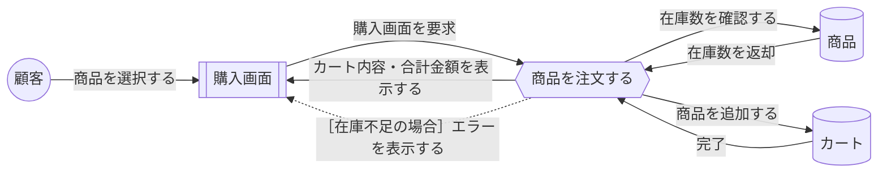

# ICONIXプロセス設計書シリーズ ③ ロバストネス図の書き方

第3回：要求と詳細設計をつなぐ架け橋

> 参考文献：『ユースケース駆動開発実践ガイド　オブジェクト指向分析からSpringによる実装まで』（著：ダグ・ローゼンバーグ／マット・ステファン）が提唱するICONIXプロセスの一般的な考え方に基づき作成

---

## 1. ロバストネス図とは

ロバストネス図（Robustness Diagram）は、ICONIXプロセスの中で最も特徴的な工程です。ユースケース記述（文章）と、シーケンス図・クラス図（厳密な設計）との「橋渡し」の役割を持ちます。ユースケース記述の1文1文を、3種類の要素（バウンダリ・コントローラ・エンティティ）に分解しながら図にしていくことで、記述の曖昧さや矛盾、抜け漏れを設計の早い段階で発見できます。

> **位置づけ**
> 4つのマイルストーンのうち「②予備設計レビュー」で検証される成果物です。ロバストネス図を1つ作るごとに、対応するユースケース記述の1文1文が実現可能かどうかを確認します。

## 2. 3つの要素

| 記号 | 名称 | 役割 | ドメインモデル／実装との対応 |
| --- | --- | --- | --- |
| 半円＋棒（画面アイコン） | バウンダリ（Boundary） | アクターとシステムの境界。画面・API入出力など | View のテンプレート（.html） |
| 丸に矢印（コントローラアイコン） | コントローラ（Controller） | 処理の流れを制御する。判断・調整役 | View の関数（views.pyのメソッド等） |
| 四角形（下線付き丸アイコン） | エンティティ（Entity） | データを保持する | ドメインモデルのクラス（Model） |

### 2.1 要素の命名規則（グループ統一）

ロバストネス図の要素名は、実装上の名前（.htmlファイル名やクラス名など）ではなく、基本的に**日本語**で命名する。

| 要素 | 命名の形式 | OK例 |
| --- | --- | --- |
| バウンダリ | 「●●画面」 | 購入画面、メニュー画面、会員登録画面 |
| コントローラ | 「●●を●●する」（ユースケース名と同じ形式） | 商品を注文する、在庫を確認する、支払いを処理する |
| エンティティ | 「●●」（名詞のみ） | 商品、カート、在庫、注文 |

> **英単語の扱いについて**
> `menu_buy.html` や `menu_buy_view`、`Product`、`Cart` のような英単語・実装名は、ロバストネス図には書かない。ロバストネス図はあくまで「日本語で業務の流れを確認する」ための図であり、実装名とのひも付けはドメインモデルの側に追記していく（例：ドメインモデルの「商品」クラスに、実装名として `menu_item` を併記する）。

## 3. 接続ルール（最重要）

ロバストネス図には、守らなければならない接続ルールがあります。このルールに違反した図は、設計として不完全とみなされます。

- アクター ↔ バウンダリ：接続してよい
- バウンダリ ↔ コントローラ：接続してよい
- コントローラ ↔ エンティティ：接続してよい
- コントローラ ↔ コントローラ：接続してよい（処理を分担する場合）
- **バウンダリ ↔ エンティティを直接つないではいけない**（必ずコントローラを経由する）
- **アクターはコントローラ・エンティティに直接話しかけない**（必ずバウンダリを経由する）

> **なぜこのルールが重要か**
> このルールは、MVC／MVTのような一般的なアーキテクチャ（画面・制御・データの分離）を、設計の早い段階で自然に強制する仕組みになっています。ルール違反が見つかったら「画面がデータを直接いじろうとしている」など、設計上の役割分担が崩れているサインです。

## 4. 基本フローと代替フローの表現（線の種類）

ユースケース記述には基本フロー（正常系）と代替フロー（分岐・エラー）がありました。ロバストネス図でも、この2つを線の種類で区別して描きます。

| フロー | 線の種類 | 意味 |
| --- | --- | --- |
| 基本フロー（Basic Course） | 実線（→） | 正常に進んだ場合の流れ |
| 代替フロー（Alternate Course） | 破線（- ->） | 分岐・エラーなど、条件によって発生する流れ |

ユースケース記述の代替フロー「②a. 在庫が不足している場合、システムはエラーメッセージを表示する」をロバストネス図に反映すると、コントローラ（商品を注文する）からバウンダリ（購入画面）へ戻る矢印を破線にし、条件（`[在庫不足の場合]`）をラベルとして添えることになります。これにより、「これは通常のルートではなく、特定の条件のときだけ通る経路である」ことが一目で分かるようになります。

> **グループでの統一ルール**
> 基本フローの矢印は実線、代替フローの矢印は破線で描き分けること。条件は［　］（角括弧）でラベルとして矢印のそばに添える。

## 5. 作成手順

1. 対象のユースケースを1つ選ぶ
2. ユースケース記述の基本フローを1文ずつ取り出す
3. その文に登場する「画面」を「●●画面」の形式でバウンダリとして配置する
4. その文の「処理の主体」を「●●を●●する」の形式でコントローラとして配置する
5. その文で扱われる「データ」を「●●」（名詞のみ）の形式でエンティティとして配置する（多くはドメインモデルの候補クラスと対応する）
6. 要素同士を、接続ルールを守りながら実線の矢印でつなぐ（基本フロー）
7. 代替フロー（分岐）がある場合は、破線の矢印と条件ラベル［　］で追加する
8. 全文を図にし終えたら、ユースケース記述と図を見比べて、抜け漏れ・矛盾がないか確認する
9. 画面名・エンティティ名に対応する実装名（.html、クラス名など）が決まったら、ロバストネス図ではなくドメインモデルに追記する

## 6. 具体例：ユースケース記述からロバストネス図へ

```text
【ユースケース記述】
基本フロー：
 ①顧客はメニュー一覧から商品を選択する。
 ②システムは在庫数を確認する。
 ③システムはカートに商品を追加する。
 ④システムはカートの内容と合計金額を表示する。
代替フロー：
 ②a. 在庫が不足している場合、システムはエラーメッセージを表示する。

【ロバストネス図への変換】
 顧客 → 購入画面（バウンダリ）：商品を選択する　　　　　　　　　［実線］
 購入画面 → 商品を注文する（コントローラ）：購入画面を要求　　　［実線］
 商品を注文する → 商品（エンティティ）：在庫数を確認する　　　　［実線］
 商品 → 商品を注文する：在庫数を返却　　　　　　　　　　　　　　［実線］
 商品を注文する → カート（エンティティ）：商品を追加する　　　　［実線］
 カート → 商品を注文する：完了　　　　　　　　　　　　　　　　　［実線］
 商品を注文する → 購入画面：カート内容・合計金額を表示する　　　［実線］
 商品を注文する -- > 購入画面：［在庫不足の場合］エラーを表示する［破線］
```

このように、ユースケース記述の「主語」と「動作の対象」を手がかりに3要素へ機械的に分解し、基本フローは実線、代替フローは破線で描き分けていくのが基本的な進め方です。要素名はすべて日本語で統一し、実装名（購入画面 → menu_buy.html など）は、この段階では書き込まずにドメインモデル側に追記していきます。

### 上記の例のMermaid表現

> ※元資料には図があったが、上の変換結果を機械的にMermaidへ書き起こしたもの。
> 凡例：`(( ))`＝アクター、`[[ ]]`＝バウンダリ（画面）、`{{ }}`＝コントローラ、`[( )]`＝エンティティ。実線＝基本フロー、破線＝代替フロー。



## 7. よくある間違い

- バウンダリとエンティティを直接つないでしまう（例：画面が直接Modelのデータを更新する矢印を引く）
- 1つのコントローラに処理を詰め込みすぎる（複雑になりすぎたら、コントローラを分割することを検討する）
- エンティティに「処理」を持たせすぎる（エンティティは基本的にデータの器であり、複雑な業務ロジックはコントローラ側に置く）
- ユースケース記述にない処理を、ロバストネス図の都合で勝手に追加してしまう → 逆にユースケース記述を見直すべきサイン
- 基本フローと代替フローをどちらも実線で描いてしまう → 代替フローは必ず破線にし、条件ラベルを添える
- バウンダリやコントローラに .html・view などの英単語（実装名）を書いてしまう → ロバストネス図は日本語表記に統一し、実装名はドメインモデルに追記する

## 8. チェックリスト

- [ ] バウンダリ・コントローラ・エンティティの3種類が正しく区別されているか
- [ ] バウンダリとエンティティが直接つながっていないか
- [ ] アクターがバウンダリを介さずにコントローラ／エンティティへ直接つながっていないか
- [ ] ユースケース記述の基本フロー・代替フローの文が、すべて図の中に反映されているか
- [ ] 基本フローは実線、代替フローは破線で描き分けられているか
- [ ] 代替フローの矢印に［条件］のラベルが添えられているか
- [ ] バウンダリが「●●画面」、コントローラが「●●を●●する」、エンティティが「●●」の日本語表記で統一されているか
- [ ] 英単語（実装名）がロバストネス図に紛れ込んでおらず、ドメインモデル側に追記される方針になっているか
- [ ] 1つのコントローラに処理が詰め込まれすぎていないか
