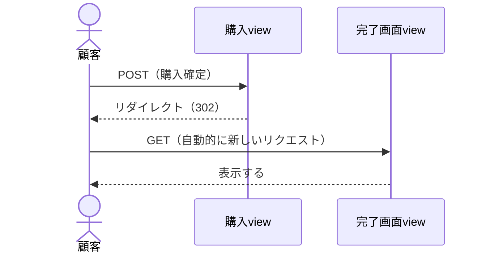
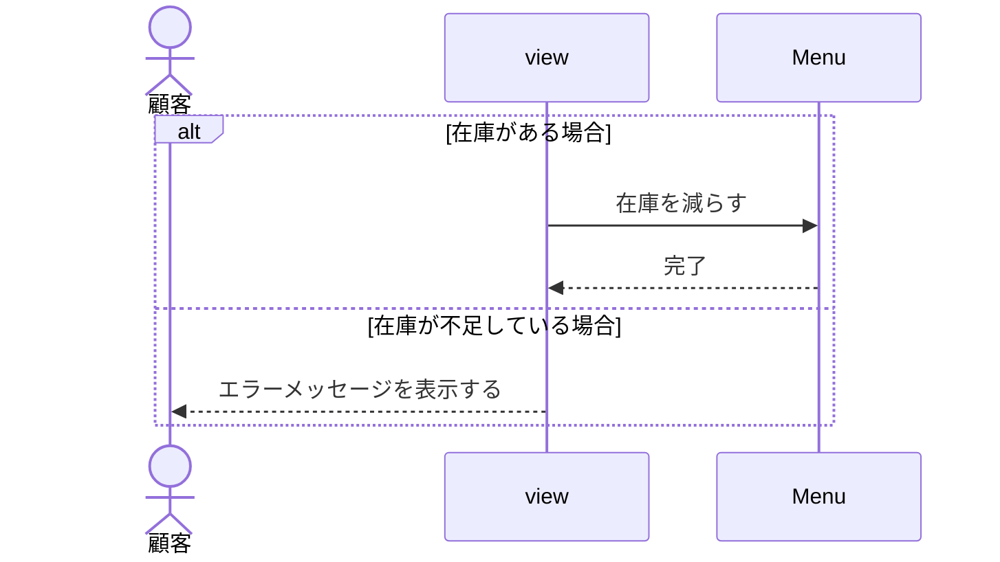

# ICONIXプロセス設計書シリーズ ④ シーケンス図の書き方

第4回：時間軸に沿った詳細設計

> 参考文献：『ユースケース駆動開発実践ガイド　オブジェクト指向分析からSpringによる実装まで』（著：ダグ・ローゼンバーグ／マット・ステファン）が提唱するICONIXプロセスの一般的な考え方に基づき作成

---

## 1. シーケンス図とは

シーケンス図は、ロバストネス図で洗い出した要素（バウンダリ・コントローラ・エンティティ）を、時間の流れに沿って並べ直した図です。ロバストネス図が「何と何がつながるか（構造）」を表すのに対し、シーケンス図は「どの順番でやり取りが行われるか（振る舞いの順序）」を表します。

> **位置づけ**
> 4つのマイルストーンのうち「③詳細設計レビュー」で検証される成果物です。ロバストネス図のメッセージを時系列に並べ替え、抜け漏れや順序の矛盾がないかを確認します。

> **本演習での範囲**
> 本演習では、**活性区間（アクティベーションバー）とloopフレームは記述しなくてよい**。メッセージの矢印と、必要に応じたalt（条件分岐）フレームのみで表現する。また、メッセージ名を具体的な関数名（メソッド名）として厳密に定義する必要もない。「在庫を確認する」のように、行われる処理が伝わる日本語のラベルであれば十分。

## 2. ロバストネス図からシーケンス図への変換

1. ロバストネス図に登場した要素（アクター・バウンダリ・コントローラ・エンティティ）を、横一列の「ライフライン」として並べる
2. ロバストネス図の矢印を、上から下へ時間順に並べ替えて「メッセージ」として描く
3. それぞれのメッセージに、処理内容が分かる日本語のラベルを付ける（例：「在庫を確認する」）
4. 戻り値がある場合は、破線の矢印で呼び出し元に返す
5. 条件分岐がある場合は、altフレームで囲む

## 3. 記法の基本要素

| 要素 | 表記 | 意味 |
| --- | --- | --- |
| ライフライン | 縦の点線 | 1つの参加者（アクター／オブジェクト）の生存期間 |
| 同期メッセージ | 実線＋塗りつぶし矢印 | 呼び出し（相手の処理が終わるまで待つ） |
| 戻りメッセージ | 破線＋開いた矢印 | 呼び出しに対する戻り値・応答 |
| alt フレーム | 「alt」ラベル付きの四角枠 | 条件によって処理が分岐する部分（if文に相当） |

> **活性区間・loopフレームについて**
> 活性区間（縦長の長方形）とloopフレームは、本演習では記述しなくてよい。矢印だけで処理の流れが追えていれば十分であり、無理に描き込む必要はない。

## 4. メッセージの書き方

- メッセージ名は、処理の内容が伝わる日本語のラベルで書く（例：「在庫を確認する」「カートに追加する」）
- 引数や具体的な関数名（例：`checkStock(id)`）は、この段階で厳密に定義しなくてよい。関数名はクラス図の工程で確定させる
- 戻り値がある場合は、戻りメッセージに何が返るかを日本語で明記する（例：「在庫数を返却」「完了」）

## 5. GET／POST・リダイレクトの書き方

ブラウザとサーバー（view）の間のやり取りを描くときは、HTTPの通信方法（GET／POST）や画面遷移（リダイレクト）が登場します。ここではその書き方を整理します。

### 5.1 GET／POSTの書き方

GET／POSTは、**ブラウザ（アクター）とview（コントローラ）の間の通信にのみ**使う。viewからEntity（Model）への内部的な呼び出しには使わない。

- 画面を表示するだけの操作（一覧を見る、フォームを開く等）→ GET
- フォーム送信・登録・購入確定など、データを送信して処理を行う操作 → POST
- メッセージのラベルは「GET（購入画面を表示する）」のように、GET／POSTのあとに内容を添えると分かりやすい

### 5.2 リダイレクトの書き方

HTTPの302リダイレクトは、元のリクエストに対する「応答」です。そのため、まず呼び出し元（ブラウザ）に戻してから、新しい別のリクエストとして次の処理を描く必要があります。1つの呼び出しは、必ずその呼び出し元に戻るまでが1セットであるという原則を思い出してください。

```text
【誤った例】
 顧客 → 購入view：購入確定
 購入view → 完了画面view：リダイレクト
            ← 呼び出し元に戻さず、別の相手へ新しい矢印を引いてしまっている

【正しい例】
 顧客 → 購入view：購入確定
 購入view -- > 顧客：リダイレクト（302）　　← いったん呼び出し元へ戻す
 顧客 → 完了画面view：（自動的に新しいリクエスト）
 完了画面view -- > 顧客：表示する
```

正しい例のMermaid表現（※上のテキストを書き起こしたもの）：



## 6. 条件分岐の描き方

ユースケース記述の代替フロー（在庫がある／ない、購入する／キャンセルするなど）は、altフレームで表現します。フレームの中に区切り線（点線）を引き、それぞれの条件をブラケット［ ］内に書きます。分岐したそれぞれの中にも、実際のメッセージ矢印を描くのを忘れないようにしてください。

```text
alt [在庫がある場合]
    view → Menu：在庫を減らす
    Menu -- > view：完了
else [在庫が不足している場合]
    view -- > 顧客：エラーメッセージを表示する
end
```

Mermaid表現（※上のテキストを書き起こしたもの）：



## 7. よくある間違い

- 呼び出し元に戻さずに、別の参加者へ次々と矢印を伸ばしてしまう（リダイレクトで特に起こりやすい）
- 戻りメッセージ（破線）を省略してしまう → 呼び出しが完結しているかどうかが分からなくなる
- GET／POSTを、システム内部（view→Entity）の呼び出しにまで使ってしまう
- altフレームの枠だけ描いて、中に実際のメッセージ矢印を描き忘れる
- ロバストネス図にない参加者・矢印が、シーケンス図で突然登場する → ロバストネス図に立ち返って整合性を確認する

## 8. チェックリスト

- [ ] すべてのライフラインが、対応するロバストネス図の要素と一致しているか
- [ ] メッセージ名が、処理内容の伝わる日本語のラベルになっているか（関数名までは不要）
- [ ] 呼び出しに対する戻り（return）が、呼び出し元まできちんと戻っているか
- [ ] GET／POSTは、ブラウザとview間の通信にのみ使われているか
- [ ] リダイレクトが、正しく「戻り」＋「新しいリクエスト」の2段階で描かれているか
- [ ] altフレームの中に、実際のメッセージ矢印が描かれているか
