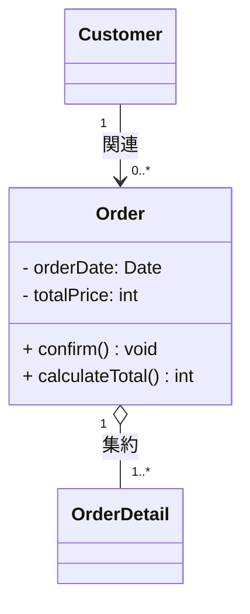
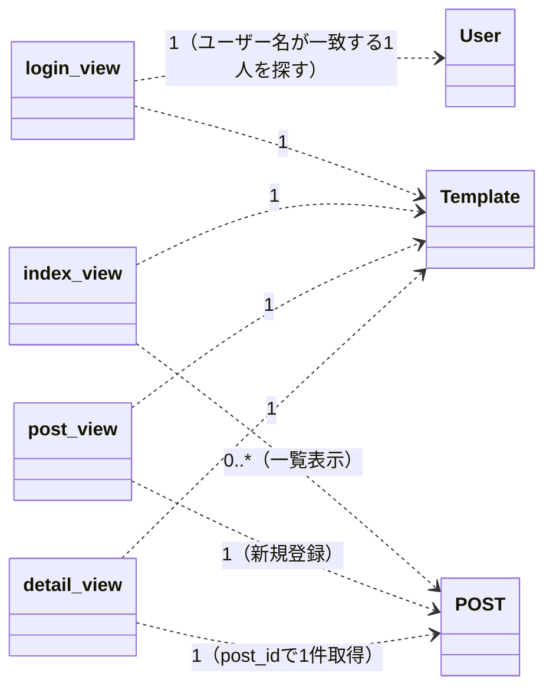

# ICONIXプロセス設計書シリーズ ⑤ クラス図の書き方

第5回：実装に直結する最終設計

> 参考文献：『ユースケース駆動開発実践ガイド　オブジェクト指向分析からSpringによる実装まで』（著：ダグ・ローゼンバーグ／マット・ステファン）が提唱するICONIXプロセスの一般的な考え方に基づき作成

---

## 1. クラス図とは

クラス図は、ICONIXプロセスの最終的な設計成果物であり、そのまま実装（コーディング）に落とし込める詳細度を持ちます。ドメインモデルで見つけたクラスに、ロバストネス図・シーケンス図で確定した属性・メソッド・関係を書き加えて完成させます。ドメインモデルが「粗いクラス図」だとすれば、クラス図は「実装直前の精緻なクラス図」にあたります。

> **位置づけ**
> 4つのマイルストーンのうち「③詳細設計レビュー」の後半、あるいは「④コードレビュー」の直前に確定する成果物です。シーケンス図で確定したメソッドが漏れなく反映されているかが、レビューの主な観点になります。

## 2. ドメインモデルからクラス図への発展

| 工程 | 書く内容 |
| --- | --- |
| ドメインモデル（①） | クラス名のみ |
| ロバストネス図（③） | エンティティ・コントローラとして名前が登場し、扱うデータの見当がつく |
| シーケンス図（④） | 実際に呼ばれたメソッド名・引数が確定する |
| クラス図（⑤） | 属性・メソッド・可視性・関係・多重度をすべて確定させる |

## 3. クラスの基本構造

クラスは3段のボックスで表します。①クラス名、②属性（そのクラスが持つデータ）、③操作／メソッド（そのクラスができること）の3つです。

### 3.1 可視性（アクセス修飾子）

| 記号 | 意味 |
| --- | --- |
| `+` | public（どこからでもアクセス可） |
| `-` | private（自クラス内のみ） |
| `#` | protected（自クラスと継承先のみ） |
| `~` | package（同一パッケージ内のみ） |

### 3.2 属性・操作の書式

```text
可視性 名前: 型 [= 初期値]
可視性 メソッド名(引数名: 型): 戻り値の型

【例】
- name: String
- price: int = 0
+ getName(): String
+ addToCart(menuId: int, quantity: int): void
```

## 4. クラス間の関係と多重度

### 4.1 多重度（Multiplicity）とは

多重度とは、線でつながった2つのクラスが「お互いに何個ずつ関係するか」を表す数字です。難しく聞こえますが、身近な例で考えるとシンプルです。

> **身近な例で考える**
> たとえば「学校のクラス」と「生徒」の関係を考えてみます。
>
> - 1つのクラス（教室）には、生徒が 0人〜40人くらい 所属する
> - 1人の生徒は、基本的に 1つのクラス にしか所属しない
>
> この「何人所属できるか」「いくつ属することができるか」という個数のルールを、線のそばに数字で書いたものが多重度です。

| 表記 | 意味 | 身近な例 |
| --- | --- | --- |
| `1` | ちょうど1つ（必ず1つだけ） | 1人の生徒には、出席番号が必ず1つだけある |
| `0..1` | 0個か1個（あってもなくてもよいが、あっても1つだけ） | 1人の生徒が持つ「部活の部長経験」は0回か1回 |
| `*` または `0..*` | 0個以上（いくつでもよい、0個でもOK） | 1つの本棚に置ける本の数（0冊でも100冊でもよい） |
| `1..*` | 1個以上（最低1つは必要） | 1つのクラスには、生徒が最低1人はいる |
| `3..5` | 3〜5個の範囲（決まった範囲の数） | 1グループの班のメンバーは3〜5人 |

### 4.2 図の中でどこに数字を書くか

多重度は、関連の線の「両端」に、それぞれ数字を書きます。線の片方だけでなく、両方に書くのがポイントです。

```text
Order  "1"  -->  "1..*"  OrderDetail
        ↑                ↑
   Order側の多重度      OrderDetail側の多重度

読み方：
「OrderDetail側から見てOrderは1つ」
「Order側から見てOrderDetailは1つ以上」
→ つまり「1つの注文（Order）は、1つ以上の注文明細（OrderDetail）を持つ」
```

> **読み方のコツ**
> 多重度の数字は、「線の反対側にあるクラスから見て、こちら側のクラスがいくつ存在できるか」を表します。矢印の先端に近い数字ではなく、それぞれのクラスの隣にある数字がそのクラス自身の個数を表すことに注意してください。

### 4.3 クラス間の関係の記法

| 関係 | 記号 | 意味 | 具体例 |
| --- | --- | --- | --- |
| 汎化（Generalization） | 実線＋白抜き三角 | is-a（継承） | `Customer <\|-- Person` |
| 集約（Aggregation） | 実線＋白抜きひし形 | 弱いhas-a（部分が全体なしでも存在できる） | `Order o-- OrderDetail` |
| コンポジション（Composition） | 実線＋黒塗りひし形 | 強いhas-a（全体が消えると部分も消える） | `Order *-- OrderDetail` |
| 関連（Association） | 実線＋矢印 | 単純な「知っている・使う」関係 | `Customer --> Order` |
| 依存（Dependency） | 破線＋矢印 | 一時的にしか使わない関係 | `OrderView ..> MailSender` |

> **依存関係と多重度について**
> 依存（破線矢印）は「一時的に使うだけの関係」なので、本来は多重度を書きません。多重度は主に、実線の関連・集約・コンポジションに対して書きます。後半の具体例では、参考として依存の矢印にも「1回の処理で何件のデータを扱うか」という目安の数字を添えていますが、これは正式なUMLのルールというより、演習用の補足情報として理解してください。

## 5. 作成手順

1. ドメインモデルのクラス一覧を土台として用意する
2. ロバストネス図・シーケンス図に登場したコントローラ／エンティティを、正式なクラスとして書き出す
3. シーケンス図で実際に呼ばれたメッセージを、各クラスのメソッドとして追加する
4. ドメインモデル・ロバストネス図で見つかった情報から、属性を確定させる
5. クラス間の関係（is-a／has-a／関連／依存）を線で結ぶ
6. 関連には多重度を書き込む
7. 可視性（`+` `-` `#` `~`）を、各属性・メソッドに設定する

## 6. 具体例：注文システムの一部

```text
Order
──────────────
- orderDate: Date
- totalPrice: int
──────────────
+ confirm(): void
+ calculateTotal(): int

Order "1" o-- "1..*" OrderDetail　　（集約：注文は1つ以上の明細を持つ）
Customer "1" --> "0..*" Order　　　（関連：顧客は複数の注文履歴を持ちうる）
```

Mermaid表現（※上のテキストを書き起こしたもの）：



## 7. 具体例：ブログシステムのクラス図（Model / View / Template）

実際の演習でよく使う「Model・View・Template」を縦3段に並べる形式でも、関係線に多重度を添えることができます。Django のようなフレームワークでは、View（関数）がModelを「何件」扱うかを多重度で示すと、一覧表示（複数件）と詳細表示（1件）の違いが図からひと目で分かるようになります。

この図の読み方：

- `login_view` → `User`：認証のために参照するUserは1件（ユーザー名が一致する1人を探す）
- `index_view` → `POST`：一覧表示なので0件以上（投稿が1つもなくても一覧画面は表示できる）
- `post_view` → `POST`：新しく1件だけ登録する
- `detail_view` → `POST`：指定された`post_id`の1件だけを取得する
- View → Template：1つのViewは1つのTemplateだけを描画する（1対1）

> ※元資料には図があったが、上の読み方から多重度の関係だけを書き起こしたもの。
> 元図の線の種類（依存・関連の別）やTemplateの具体名は元資料のテキストに無いため、ここでは依存（破線）とテンプレートの汎用名で表している。



> **多重度を書くとどう役立つか**
> 「0..*」と「1」の違いを意識するだけで、「このViewは一覧処理か、それとも単一データの処理か」が図を見ただけで分かるようになります。実装のときも、多重度が0..*なら for文でループする処理、1なら単一オブジェクトを扱う処理、と設計の見通しが立てやすくなります。

## 8. よくある間違い

- シーケンス図で確定したメソッドを、クラス図に反映し忘れる
- 集約（弱いhas-a）とコンポジション（強いhas-a）を区別せず、すべて同じ矢印で描いてしまう
- 可視性をすべて public（`+`）にしてしまい、カプセル化の意図が図から読み取れない
- 多重度を書かない、または「1対1」と決め打ちしてしまい、実際の業務ルール（1人の顧客が複数注文できる、等）と矛盾する
- 多重度を線の片側にしか書かない（両端に書く）
- View・Controllerなど実装レイヤーの要素と、ドメインの概念（Entity）を区別せずに1枚の図に混在させ、責務が分かりにくくなる

## 9. チェックリスト

- [ ] シーケンス図で登場したメソッドが、すべてクラス図に反映されているか
- [ ] 属性・メソッドに、適切な可視性（`+` `-` `#` `~`）が設定されているか
- [ ] is-a／集約／コンポジション／関連／依存が、意味に応じて正しく使い分けられているか
- [ ] 関連線の両端に多重度が明記されているか
- [ ] ドメインモデルの段階から一貫してクラス名・関係が変わっていないか（変わった場合は理由を説明できるか）
